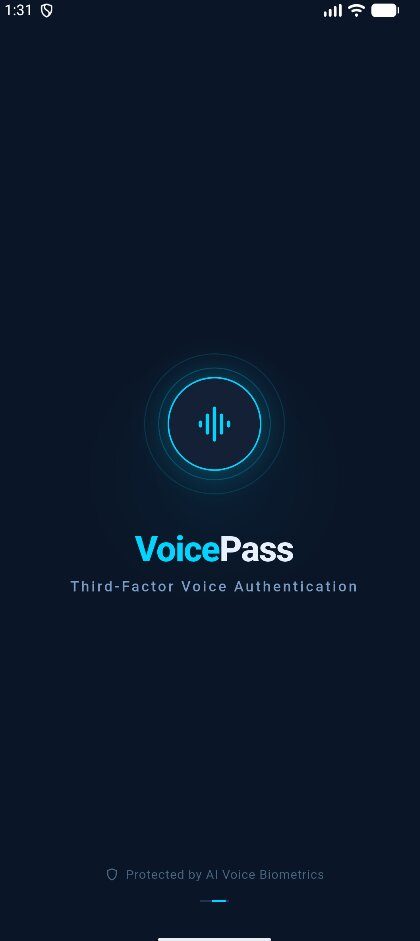
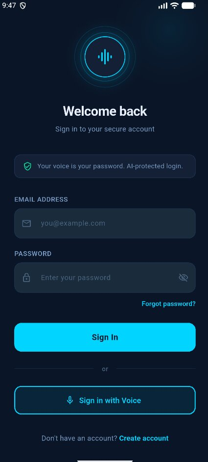
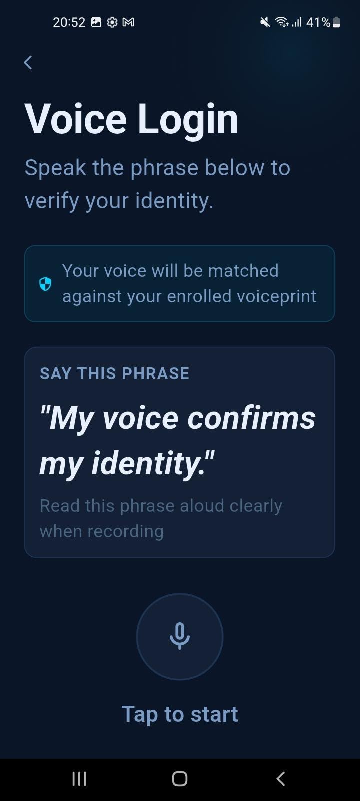
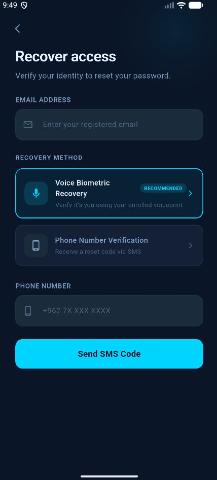
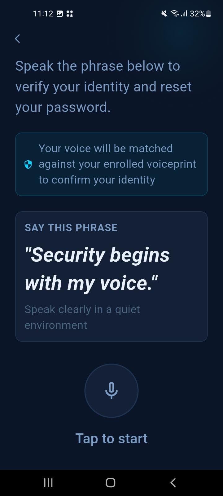
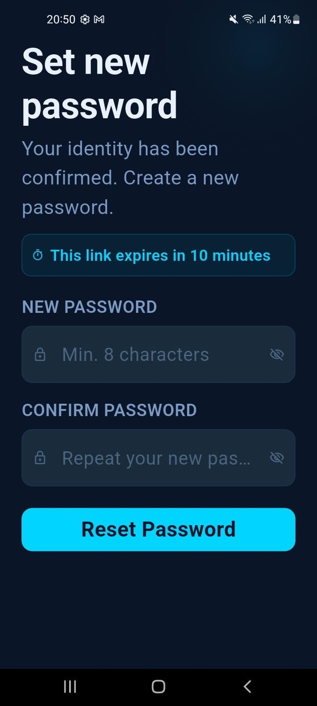

# VoicePass 🎤🔐
### A Third-Factor Voice Biometric Authentication System

A mobile banking authentication system that uses AI-powered voice biometrics 
as a third authentication factor — beyond passwords and SMS OTP codes.

---

## 🚀 Features
- **Voice Enrollment** — Record 3 voice samples to create a unique voiceprint
- **Passwordless Voice Login** — Speak a dynamic challenge phrase to authenticate
- **3-Layer AI Security** — Anti-spoofing → Speech verification → Speaker matching
- **Deepfake Detection** — Rejects AI-generated and replayed voices
- **Voice Account Recovery** — Reset password using your voice instead of SMS
- **Dynamic Challenge Phrases** — New random phrase every session to prevent replay attacks

---

## 🏗️ Architecture
Flutter Android App (Yazeed)
↓ REST API / JWT
FastAPI Backend (Mahmoud)
↓
┌─────────────────┬──────────────────┐
│ PostgreSQL │ AI Models │
│ Database │ ECAPA-TDNN │
│ │ Whisper STT │
│ │ Anti-Spoof CM │
└─────────────────┴──────────────────┘

---

## 📱 Tech Stack

| Layer | Technology |
|-------|-----------|
| Mobile App | Flutter / Dart |
| Backend | Python / FastAPI |
| Database | PostgreSQL / SQLAlchemy |
| Speaker Verification | ECAPA-TDNN (SpeechBrain) |
| Speech Recognition | OpenAI Whisper STT |
| Anti-Spoofing | Pretrained CM Model |
| Authentication | JWT / bcrypt |

---

## 📊 Results
- ✅ 18/18 successful verifications on final test set
- ✅ < 3% False Acceptance Rate
- ✅ > 90% spoofing detection rate
- ✅ Threshold calibrated from real recorded data (0.45)

---

## 👥 Team
| Name | Role |
|------|------|
| Yazeed Salameh | Flutter Mobile Developer |
| Mahmoud Aldoum | Backend & AI Developer |

**Supervisor:** Dr. Amani Abu Jabal  
**University:** German Jordanian University  
**Department:** Computer Science — Cybersecurity Track  
**Semester:** Summer 2025/2026

---

## 📁 Repository Structure

voice_auth_project/
├── frontend/ ← Flutter Android app (Yazeed)
│ ├── lib/
│ │ ├── screens/ 9 screens
│ │ ├── services/ API service layer
│ │ └── theme/ Design system
└── backend/ ← Python FastAPI server (Mahmoud)
├── app/
│ ├── routes/
│ ├── models/
│ └── services/

## 📸 App Screenshots

| Splash | Login | Voice Enrollment |
|--------|-------|-----------------|
|  |  |  |

| Voice Login | Forgot Password | Reset Recording |
|-------------|------|----------------|
|  |  |  |

| New Password |
|  |
